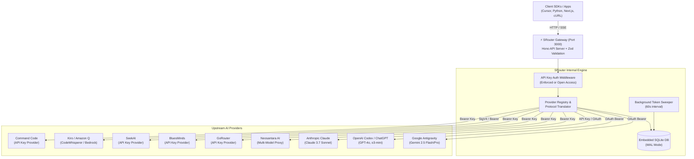

<div align="center">

# ⚡ SRouter

**The Next-Generation Multi-Provider AI Gateway & LLM Routing Hub.**

[](LICENSE)
[](https://nodejs.org/)
[](https://www.typescriptlang.org/)
[](https://hono.dev/)
[](https://react.dev/)
[](https://turbo.build/)
[](https://sqlite.org/)
[](.github/workflows/ci.yml)

[Features](#-key-features) • [Architecture](#-architecture) • [Quick Start](#-quick-start) • [Docker Deployment](#-docker-deployment) • [Supported Providers](#-supported-providers) • [Client Examples](#-client-integration) • [API Reference](#-api-reference) • [Contributing](#-contributing)

</div>

---

## 📖 Overview

**SRouter** is an ultra-fast, local-first LLM API Gateway and proxy router engineered in TypeScript, [Hono](https://hono.dev/), and native SQLite (`node:sqlite`). It unites upstream AI providers—including Google Antigravity, OpenAI Codex/ChatGPT, Anthropic Claude, Neosantara, Amazon Q / Kiro, and Command Code—under a **single, unified OpenAI and Anthropic compatible API**.

Whether you are building downstream AI agents, integrating LLMs into Cursor/VSCode, or running automated pipelines, SRouter handles OAuth PKCE handshakes, automatic background token refresh, live upstream rate limit monitoring, virtual key issuance, and full token usage analytics seamlessly on your own hardware.

---

## 🌟 Key Features

- 🔀 **100% OpenAI & Anthropic Compatible Gateway**
    - Drop-in replacement for `https://api.openai.com/v1` and Anthropic APIs.
    - Native Server-Sent Events (SSE) streaming with usage chunk normalization.
    - Automatic model protocol translation (OpenAI JSON Schema <-> Claude tool calling).

- ⚡ **Zero-Overhead Hono Core & SQLite Engine**
    - Powered by Hono's lightweight routing tree and Node's embedded `node:sqlite`.
    - Zero external database dependencies; lightning-fast WAL-mode transactions.

- 🔄 **Automated OAuth Token Refresh Sweeper**
    - Embedded background daemon sweeps and refreshes expiring OAuth tokens automatically before expiration.
    - Built-in local PKCE OAuth callback server on port `1455`.

- 📊 **Real-time Quota & Rate Limit Telemetry (`/quota`)**
    - Live percentage monitors, countdown reset timers, and per-model consumption history.
    - Visual status color indicators (`ok`, `warning`, `exhausted`).

- 🔑 **Virtual Client API Keys & Configurable Enforcement (`/keys`, `/settings`)**
    - Generate virtual client keys (`sr-live-...`) with custom quotas and rate limits.
    - Global security toggle: **Enforce API Key** (HTTP 401 on missing key) or **Open Access** for local development.

- 🧪 **Interactive Web Playground (`/playground`)**
    - Full-featured chat interface with streaming SSE, thinking/reasoning model visualizations, parameter sliders, multi-session tabs, and one-click code generation.

- 🎨 **Minimalist Editorial Dashboard**
    - Fluid TanStack Table pagination and multi-column sorting.
    - Built with Tailwind CSS v4, Base UI, Lucide icons, and responsive Dark/Light themes with View Transitions.

---

## 🏛 Architecture



---

## 🚀 Quick Start

### Prerequisites

- **Node.js** `v22.0.0+` or `v24.0.0+`
- **pnpm** `v10.0.0+` (`corepack enable pnpm`)

### 1. Clone & Install

```bash
git clone https://github.com/seaavey/SRouter.git
cd SRouter
pnpm install
```

### 2. Run Development Servers

```bash
pnpm dev
```

This concurrently boots:

- **API Gateway**: `http://localhost:3000`
- **Web Dashboard**: `http://localhost:5173`
- **OAuth Callback Server**: `http://localhost:1455`

### 3. Open the Dashboard

Navigate to [http://localhost:5173](http://localhost:5173) in your browser:

1. Connect your preferred providers in **Providers Catalog**.
2. Generate an API Key under **API Keys** (optional if Open Access is enabled).
3. Test your models directly in the **Playground**.

---

## 🐳 Docker Deployment

Deploy SRouter easily to any VPS, home server, or cloud VM using Docker Compose.

### 1. Using Docker Compose (Recommended)

Clone the repository and spin up the unified container:

```bash
git clone https://github.com/seaavey/SRouter.git
cd SRouter
docker compose up -d
```

SRouter will build and run in the background:

- **Web Dashboard & API Gateway**: [http://localhost:3000](http://localhost:3000) (or `http://<your-vps-ip>:3000`)
- **OAuth Callback Server**: `http://localhost:1455`
- **Health Check**: `http://localhost:3000/health`

### 2. Persistent Storage

All providers, client API keys, logs, and settings are saved in SQLite WAL mode and persisted automatically inside the `srouter_data` Docker volume (`/app/data`).

To use a host bind mount instead, edit `docker-compose.yml`:

```yaml
volumes:
    - ./data:/app/data
```

### 3. Manage Container

```bash
# View live logs
docker compose logs -f

# Check container health status
docker compose ps

# Update to latest version
git pull
docker compose up -d --build

# Stop the container
docker compose down
```

---

## 🌐 Supported Providers

| Provider                   | Auth Type       | Model Prefix     | SSE Streaming | Reasoning / Thinking | Quota Sync |
| :------------------------- | :-------------- | :--------------- | :-----------: | :------------------: | :--------: |
| **Google Antigravity**     | OAuth 2.0 PKCE  | `antigravity/*`  |      ✅       |   ✅ (Flash / Pro)   |     ✅     |
| **OpenAI Codex / ChatGPT** | OAuth 2.0 PKCE  | `openai_codex/*` |      ✅       |     ✅ (o1 / o3)     |     ✅     |
| **Anthropic Claude**       | API Key / OAuth | `anthropic/*`    |      ✅       |   ✅ (3.7 Sonnet)    |     ✅     |
| **Neosantara**             | Bearer API Key  | `neosantara/*`   |      ✅       |          ✅          |     ✅     |
| **Kiro (Amazon Q)**        | AWS SigV4 / Key | `kiro/*`         |      ✅       | ✅ (Thinking Suffix) |     ✅     |
| **Command Code**           | Bearer API Key  | `commandcode/*`  |      ✅       |          ✅          |     ✅     |
| **GoRouter**               | Bearer API Key  | `gorouter/*`     |      ✅       |          ✅          |     ✅     |

---

## 💻 Client Integration

Point any OpenAI-compatible client or library to your SRouter gateway:

### Python (`openai` SDK)

```python
from openai import OpenAI

client = OpenAI(
    base_url="http://localhost:3000/v1",
    api_key="sr-live-your_virtual_key"  # Or any string if Require API Key is disabled
)

response = client.chat.completions.create(
    model="antigravity/gemini-2.5-flash",
    messages=[{"role": "user", "content": "Explain quantum computing in 3 sentences."}],
    stream=True
)

for chunk in response:
    content = chunk.choices[0].delta.content or ""
    print(content, end="", flush=True)
```

### TypeScript / Node.js (Official OpenAI SDK)

```typescript
import OpenAI from "openai";

const openai = new OpenAI({
    baseURL: "http://localhost:3000/v1",
    apiKey: process.env.SROUTER_API_KEY || "sr-live-dev-key",
});

const completion = await openai.chat.completions.create({
    model: "openai_codex/gpt-4o",
    messages: [{ role: "user", content: "Write a quicksort in TypeScript." }],
});

console.log(completion.choices[0].message.content);
```

### cURL (Streaming SSE)

```bash
curl -N http://localhost:3000/v1/chat/completions \
  -H "Content-Type: application/json" \
  -H "Authorization: Bearer sr-live-your_key" \
  -d '{
    "model": "anthropic/claude-3-7-sonnet",
    "messages": [{"role": "user", "content": "Hello SRouter!"}],
    "stream": true
  }'
```

### Cursor / VSCode Integration

In Cursor or VSCode AI extensions:

1. Set **OpenAI Base URL**: `http://localhost:3000/v1`
2. Set **API Key**: `sr-live-...` (or any placeholder if Open Access mode is on)
3. Use model names like `antigravity/gemini-2.5-flash` or `openai_codex/gpt-4o`.

---

## 🔌 API Reference

### Gateway Core Endpoints

| Method | Route                  | Description                                                 |
| :----- | :--------------------- | :---------------------------------------------------------- |
| `POST` | `/v1/chat/completions` | Create OpenAI-compliant chat completion (JSON / SSE stream) |
| `POST` | `/v1/chat/completion`  | Alias for single chat completion                            |
| `GET`  | `/v1/models`           | List all discovered models across all connected providers   |
| `GET`  | `/v1/models/:model`    | Retrieve model specification and context limits             |

### Management & Telemetry Endpoints

| Method   | Route               | Description                                                     |
| :------- | :------------------ | :-------------------------------------------------------------- |
| `GET`    | `/health`           | Server health check and gateway status                          |
| `GET`    | `/v1/providers`     | List active provider connections and runtime status             |
| `POST`   | `/v1/providers`     | Register or update provider credentials                         |
| `DELETE` | `/v1/providers/:id` | Disconnect and unregister a provider                            |
| `GET`    | `/v1/quota`         | Get live upstream quota meters and token usage metrics          |
| `GET`    | `/v1/keys`          | List all virtual client API keys                                |
| `POST`   | `/v1/keys`          | Generate a new virtual client key (`sr-live-...`)               |
| `DELETE` | `/v1/keys/:id`      | Revoke and delete a client API key                              |
| `GET`    | `/v1/settings`      | Read global gateway and security preferences                    |
| `POST`   | `/v1/settings`      | Update security enforcement (`requireApiKey`, timeout, retries) |
| `GET`    | `/v1/logs`          | Query request audit logs and latency breakdown                  |
| `GET`    | `/v1/logs/stats`    | Aggregate token consumption metrics and cost estimates          |

---

## 📂 Monorepo Structure

```
SRouter/
├── apps/
│   ├── api/             # Hono REST API server, OAuth flows & Token Sweeper
│   └── web/             # Dashboard UI (Vite, React 19, TanStack Router/Table)
├── packages/
│   ├── constants/       # Global constants, default configs & model lists
│   ├── db/              # SQLite repository & schema migrations (node:sqlite)
│   ├── executors/       # Upstream protocol drivers (Antigravity, Kiro, Codex)
│   ├── pricing/         # Real-time token pricing calculators
│   ├── providers/       # Multi-provider coordinator & runtime registry
│   ├── translator/      # Bidirectional OpenAI <-> Claude protocol transformers
│   └── types/           # Concrete TypeScript types & Zod validation schemas
├── .github/
│   └── workflows/ci.yml # Automated GitHub Actions build & test pipeline
├── CONTRIBUTING.md      # Contribution guidelines & code conventions
├── SECURITY.md          # Security policy and vulnerability disclosure
├── LICENSE              # MIT License
└── turbo.json           # Turborepo task pipeline configuration
```

---

## 🛠️ Development & Testing

```bash
# Run all monorepo unit tests
pnpm test

# Build production bundles
pnpm build

# Format codebase with Prettier
pnpm exec prettier --write "**/*.{ts,tsx,json,md,css}"
```

---

## 🛣️ Roadmap

- [x] Multi-provider OAuth PKCE session handling & token sweeper
- [x] Upstream quota & live rate limit monitoring (`/quota`)
- [x] Configurable gateway security (`Require API Key` toggle in `/settings`)
- [x] TanStack Table migration for all dashboards and logs
- [ ] Multi-region upstream load balancing & automatic fallback cascades
- [ ] Response semantic caching layer with SQLite vector search
- [ ] Docker compose & one-click deploy templates (Railway, Fly.io, Render)

---

## 📄 License

Distributed under the **MIT License**. See [`LICENSE`](LICENSE) for more information.

---

<div align="center">
  <sub>Built with ❤️ by the SRouter Community.</sub>
</div>
